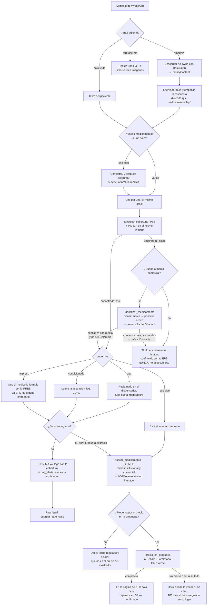

# Curuba — API

El servicio que está detrás del número de WhatsApp. Recibe los mensajes que reenvía
Twilio, corre el agente y responde: cotiza fórmulas contra SISMED, consulta
desabastecimientos del INVIMA y genera el PDF de una tutela.

> **Estado: camina de punta a punta.** Existen `config.py`, `db.py`, `agent.py`,
> `main.py`, `etl.py`, `schema.sql` y los paquetes `tools/` y `legal/`.
> Las tres fuentes están cargadas en Postgres (2.067 / 38.731 / 783 filas) y el agente
> contesta con las siete tools. La entrevista legal guarda en `casos`, `decidir_ruta()`
> escoge mecanismo, los cuatro PDF se generan y `GET /f/{id}` los sirve para que Twilio
> los adjunte. Las fotos de fórmulas se leen (`BinaryContent`), y cuando el paciente
> dice una marca comercial en vez de un principio activo, `identificar_medicamento` la
> traduce buscando en la web.

**Lo importante de la arquitectura: es un solo agente con siete tools, no tres
endpoints.** WhatsApp es una sola conversación, así que no hay ruteo por palabras clave
ni menús — el modelo decide qué tool usar. Eso es lo que permite que "mándame una foto de
tu fórmula", "¿el losartán está desabastecido?" y "no me entregan el losartán" convivan en
el mismo hilo sin código de despacho.

**Y lo segundo: qué escrito procede lo decide Python, no el modelo.** La ruta legal tiene
cuatro escalones y escoger mal el escalón es el modo de falla real — llevarle a la
Supersalud un problema de entrega es tocar una puerta que no tiene competencia. Por eso
`decidir_ruta()` vive en `legal/ruteo.py`, igual que `COBERTURAS` y `ESTADOS` viven en
`tools/medicamentos.py`: lo que tiene consecuencia legal o clínica se traduce en Python y
no se deja a interpretación del modelo.

## Stack

| Pieza | Qué |
|---|---|
| Web | FastAPI + Uvicorn |
| Agente | Pydantic AI (`pydantic-ai-slim[openrouter]`) |
| Modelo | Claude vía OpenRouter |
| Datos | Postgres con `pg_trgm` y `unaccent` (asyncpg) |
| Canal | Twilio WhatsApp |
| PDF | `fpdf2` |
| Deploy | Railway |

## Estructura planeada

Siete archivos. Es a propósito: antes de crear uno nuevo, extender el que ya existe.

```
apps/api/
├── pyproject.toml
├── requirements.txt          # exportado de uv; red de seguridad para Nixpacks
├── railway.json
├── .env
└── src/curuba/
    ├── main.py
    ├── config.py
    ├── db.py
    ├── agent.py
    ├── etl.py
    ├── schema.sql
    ├── tools/                 las tools, un módulo por grupo
    │   ├── __init__.py        TOOLSETS
    │   ├── deps.py            Deps
    │   ├── medicamentos.py    PBS, SISMED, INVIMA + las dos de la web
    │   ├── web.py             Sonar: sub-agente, esquemas y validaciones
    │   └── ruta_legal.py      entrevista y generación
    └── legal/                 la lógica legal, sin saber del agente
        ├── __init__.py        API pública + generar()
        ├── texto.py           normalizar()
        ├── documentos.py      los cuatro escritos, canales, aviso
        ├── fechas.py          leer_fecha, habiles_desde
        ├── campos.py          CAMPOS, validar, qué falta
        ├── ruteo.py           decidir_ruta  ← el corazón
        ├── pdf.py             maquetación
        ├── DejaVuSans*.ttf    fuente Unicode (ver trampa #2)
        └── plantillas/        un archivo por escrito
            ├── comun.py       lo que comparten los cuatro
            ├── peticion.py
            ├── tutela.py
            ├── desacato.py
            └── supersalud.py
```

| Dónde | Qué va adentro |
|---|---|
| `main.py` | App de FastAPI: webhook de Twilio, `GET /f/{id}`, `/health` |
| `config.py` | Settings desde el entorno con `pydantic-settings` |
| `db.py` | Pool de asyncpg y **todo** el SQL del proyecto |
| `agent.py` | El `Agent`: prompt del sistema y el ciclo de conversación. **Ya no tiene tools** |
| `tools/` | Un `FunctionToolset` por grupo. Agregar un grupo es un archivo y un renglón en `TOOLSETS` — no se toca `agent.py` |
| `legal/` | Campos, ruteo, plantillas y PDF. **No importa nada del agente**: se puede usar y probar solo |
| `etl.py` | Carga `resources/data/` a Postgres — se corre en local, no en Railway |
| `schema.sql` | Tablas, extensiones e índices |

**El paquete `legal/` se lee de abajo hacia arriba** y cada módulo depende solo de los
anteriores: `texto` → `documentos` → `fechas` → `campos` → `ruteo` → `plantillas` → `pdf`.
Esa cadena es lo que permite probar el ruteo sin base de datos y sin modelo.

**Las tools van en toolsets, no en `@agente.tool`.** Si las tools importaran `agente` y
`agent.py` importara las tools, el ciclo sería inevitable; con `FunctionToolset` las tools
no saben que existe un agente y `agent.py` importa una sola lista. `Deps` vive en
`tools/deps.py` por la misma razón.

## Las siete tools

| Tool | Qué hace |
|---|---|
| `consultar_cobertura(nombre)` | Busca en el PBS si lo financia la UPC. Devuelve la cobertura (`upc`, `condicionada`, `mipres`, `excluido`), qué significa y la aclaración textual. **Y el INVIMA pegado en `desabastecimiento`** |
| `buscar_medicamento(nombre)` | Busca en SISMED por similitud y devuelve hasta 8 candidatos con presentación, laboratorio, los dos techos regulados y **score**. **Y el INVIMA pegado en `desabastecimiento`** |
| `consultar_desabastecimiento(nombre)` | Busca en el seguimiento del INVIMA; devuelve estado (`monitorizacion`, `riesgo`, `desabastecido`, `no_desabastecido`) y fecha, o dice explícitamente que no hay reportes. Queda para la pregunta directa: las dos de arriba ya lo traen |
| `identificar_medicamento(nombre)` | Marca comercial → principio activo, buscando en la web. **Y vuelve a consultar las tres bases él mismo** con el nombre resuelto |
| `precio_en_drogueria(nombre)` | Busca en La Rebaja, Farmatodo y Cruz Verde lo que publican hoy. Se **niega** si todavía no se consultó la cobertura |
| `guardar_dato_caso(campo, valor)` | Guarda una respuesta de la entrevista **y hace el triage**: devuelve la ruta que procede, el porqué y las preguntas que faltan, ya redactadas |
| `generar_documento(tipo)` | Arma el PDF del escrito, lo guarda y devuelve su URL pública. Se **niega** si ese escrito no corresponde a la ruta |

Cuatro son `@agente.tool` porque necesitan `RunContext`: las dos de la ruta legal (para
saber de qué número es la conversación), `identificar_medicamento` y
`precio_en_drogueria` (para sumar el gasto del sub-agente al de la corrida), y
`consultar_cobertura` (para anotar lo que ya consultó). `buscar_medicamento` y
`consultar_desabastecimiento` siguen siendo `tool_plain`.

**El INVIMA no espera a que el modelo lo pida.** `_con_invima()` compone cualquier
consulta de medicamento con `_desabasto()` y las corre en paralelo con `asyncio.gather`,
así que `consultar_cobertura` y `buscar_medicamento` devuelven el estado de
abastecimiento adentro sin costar tiempo (`identificar_medicamento` ya lo traía). La
razón es que el paciente que pregunta "¿me lo cubre la EPS?" no sabe que el
desabastecimiento se pregunta aparte — y es justo lo que explica por qué no se lo
entregan. Dejárselo a criterio del modelo era perder el caso más útil.

Y como ahora llega en todas las consultas, **Python decide si es noticia**: `_desabasto`
calcula `hay_alerta` (`desabastecido`, `riesgo` o `monitorizacion` — el conjunto
`ALERTAS`) y el prompt solo lo menciona si es `true`. Sin ese filtro, el modelo le
contaría a alguien que preguntó un precio que su medicamento tuvo un seguimiento cerrado:
`no_desabastecido` son 373 de las 783 filas. El camino automático además pide 3
candidatos y no 8, porque esto viaja en cada turno y una fórmula trae cuatro medicamentos.

> **`hay_alerta` mira solo el mejor score, no todos los candidatos.** Con `any()` sobre
> los tres se prendía en casi toda consulta y no filtraba nada: "acetaminofén 500 mg" trae
> `PARACETAMOL (ACETAMINOFÉN) TABLETA 500 mg` en 0,74 con el caso cerrado y detrás, en
> 0,65, otra presentación que sí está en monitorización. La alerta la manda la fila que de
> verdad corresponde al medicamento, no la que se le parezca de lejos.

### El árbol de decisión



**El orden no se puede saltar, y eso está en código.** Si el primer mensaje del hilo es
"¿cuánto vale el adalimumab en la droguería?", `precio_en_drogueria` levanta `ModelRetry`
y el agente tiene que pasar por `consultar_cobertura` antes. No es celo: el adalimumab
está financiado con la UPC, y contestar el precio de frente manda a alguien a gastar
$800.000 que la EPS tenía que ponerle. Verificado — contesta la cobertura y le dice que
no lo compre.

### La red de seguridad en la web

Las tres bases están indexadas por **principio activo**, y el paciente habla de
**marcas**: "Dolex", "Noxpirin", "Winadeine F". Sin traducción, esas tres consultas
mueren en `encontrado: false`. `identificar_medicamento` sale a Perplexity Sonar
(`perplexity/sonar` por OpenRouter — **la misma llave, sin dependencia nueva**), y con el
principio activo que encuentra **vuelve a consultar las tres bases él mismo** en vez de
pedirle al modelo que las llame otra vez: ahorra tres turnos de ~3 s y garantiza que el
bucle cierre.

Cuatro cosas se decidieron en Python y no se le dejan al modelo:

- **La pregunta que se le hace a Sonar la escribe Python**, no el modelo. Incluye que el
  nombre venga en **nomenclatura colombiana**: sin eso Sonar contesta "paracetamol" y
  `coverage` dice `ACETAMINOFÉN` — cero filas, justo en el medicamento más común del país.
- **Sin fuentes, la confianza baja a `baja`.** Y las fuentes se validan: la primera
  versión devolvía `['1', '4', '5']`, los numeritos de las citas, no las URL.
- **Si el `pais` no es Colombia, se reporta como no encontrado.** Las marcas se repiten
  entre países con composiciones distintas.
- **Un precio fuera de la banda de plausibilidad se descarta** (queda `precio: null` y el
  agente dice dónde lo venden, sin cifra).

> **Por qué la banda es absoluta y no un cruce contra SISMED.** El plan original
> comparaba el precio scrapeado contra el techo del SISMED. No funciona, y se midió:
> `acetaminofén 500` no está en SISMED (cero filas), y `losartán 50` solo trae ARAMAX,
> que es *amlodipino + losartán*, en cajas de 200/500/1500 mg. Comparar una caja x30 de
> losartán solo contra eso no significa nada. La banda absoluta sí caza el error real:
> un precio por tableta leído como precio de caja, o una cifra en otra moneda.

**Los precios de droguería van en dos pasos, y eso tampoco es gratuito.**
`PromptedOutput` mete el esquema JSON dentro del mensaje del usuario, y Perplexity arma
su búsqueda web a partir de ese mensaje: con el esquema encima, Sonar contestó
`encontrado: false` para losartán, acetaminofén e ibuprofeno — los tres. La misma
pregunta en prosa sí encuentra la ficha con precio y URL. Así que el paso 1 le pregunta
en español plano y el paso 2 le pasa esa prosa a Claude para estructurarla.

**Camino considerado y descartado:** `capabilities=[WebSearch()]` en el agente principal
(OpenRouter lo soporta, es una línea). Le daría a Claude una búsqueda web sin alcance en
una app de salud, donde podría contestar una pregunta de cobertura con un blog en vez de
con la tabla `coverage`, y la consulta que va al buscador no sería nuestra.

**`consultar_cobertura` va primero y el prompt lo dice.** Si el medicamento está
financiado con la UPC, el precio es casi irrelevante: la ruta es el dispensador de la EPS
pagando la cuota moderadora. Dar el precio antes manda al paciente a gastar plata que no
tenía que gastar. Comparar precios ahorra 20–40 %; enrutar bien ahorra ~100 %.

**Las tres tools de datos devuelven `encontrado` aparte de los candidatos.** Es para que
"no lo encontré" no se pueda confundir con "la respuesta es no" — sobre todo en cobertura,
donde el listado no es exhaustivo. Y el significado de cada estado se traduce en Python
(`COBERTURAS` y `ESTADOS` en `agent.py`), no se deja a interpretación del modelo: `mipres`
**no** es "cómprelo usted".

**Cotizar una fórmula completa no es una tool aparte**: el agente llama
`buscar_medicamento` una vez por medicamento y suma. Menos código y el modelo maneja
mejor los casos raros (dos presentaciones del mismo principio activo, un medicamento que
no aparece).

**La entrevista tampoco es una máquina de estados.** El agente pregunta de a una, guarda
cada respuesta con `guardar_dato_caso`, y esa tool le devuelve la ruta y los campos que
faltan. Así maneja gratis las respuestas desordenadas, las correcciones y los mensajes
donde la persona contesta tres cosas de una — verificado: contestar en desorden mete cada
dato en el campo correcto y el agente sigue repreguntando solo lo que falta.

## La ruta legal

Cuatro escritos, no uno. La tutela es el último escalón.

| Ruta | Cuándo | Fundamento |
|---|---|---|
| `peticion` | Problema de entrega, sin riesgo y sin haber pedido nada por escrito | Art. 23 CP · Ley 1755/2015 |
| `tutela` | Riesgo vital (directo, con medida provisional), o petición radicada y vencida | Art. 86 CP · Decreto 2591/1991 |
| `desacato` | Ya hubo fallo de tutela y la EPS no cumple | Decreto 2591/1991 art. 52 |
| `supersalud` | El problema es de **cobertura o reembolso**, no de entrega | Ley 1122/2007 art. 41 |
| `esperar` | Petición radicada y la EPS todavía en plazo → se ofrece PQRD | — |
| `indefinida` | Falta cerrar el triage | — |

**El orden de las reglas en `decidir_ruta()` es el contenido**, no un detalle. Riesgo vital
se evalúa de segundo y nunca puede terminar mandando a alguien a esperar 15 días hábiles.
Y un problema de entrega **nunca** puede rutear a `supersalud`: T-243 de 2016 y T-163 de
2018 excluyeron el suministro y la entrega de medicamentos de su función jurisdiccional.
Las dos cosas están cubiertas por la tabla de verdad de la verificación.

Dos detalles que cuestan un bug si se ignoran:

- **Un `si_no` ambiguo no decide.** "más o menos" a "¿corre riesgo tu vida?" deja la ruta
  en `indefinida` y repregunta, en vez de contarse como un no y mandar a esperar.
- **Las fechas llegan en letras.** Nadie escribe `2026-07-02` por WhatsApp, escriben "el 2
  de julio". `leer_fecha` entiende las dos, y de eso depende que `decidir_ruta` sepa si la
  EPS ya está en mora.

### Campos

28 en total, en `legal.CAMPOS`, con la pregunta ya redactada para el paciente. Cada uno
declara en qué documentos es **obligatorio** y en cuáles solo **útil**:

- **Identidad** — `nombre` · `cedula` · `ciudad` · `direccion` · `telefono` · `correo`
- **El caso** — `eps` · `gestor_farmaceutico` · `medicamento` · `enfermedad` ·
  `fecha_prescripcion` · `fecha_reclamacion`
- **Triage** — `riesgo_vital` · `tipo_problema` · `peticion_radicada` (+`peticion_radicado`,
  `peticion_fecha`) · `tutela_previa`
- **Pretensiones opcionales** — `otro_municipio` · `copagos` · `sujeto_especial`
- **Solo desacato** — `tutela_numero` · `tutela_juzgado` · `tutela_fecha_fallo` ·
  `tutela_incumplimiento`
- **Solo Supersalud** — `negativa_fecha` · `negativa_medio` · `monto_reembolso`

**Con los obligatorios ya genera.** Lo que falte sale como `[COMPLETAR: …]` visible en el
PDF y la tool devuelve la lista en `marcadores` para que el agente los lea en voz alta. Es
coherente con que el documento sea un borrador que debe revisarse antes de radicarse.

Los PDF cubren lo que un juez va a mirar: hechos, derechos vulnerados (arts. 11, 1 y 49
C.P. y Ley 1751 de 2015), **procedibilidad** (subsidiariedad, inmediatez, legitimación por
activa y por pasiva, no temeridad), pretensiones, juramento, pruebas, notificaciones y
firma. La tutela vincula también al **gestor farmacéutico**: es quien dispensa y sin él la
orden se queda sin destinatario operativo.

**El PQRD ante la Supersalud no es un escrito y por eso no se genera** — es una línea
telefónica y un formulario web. Está en `legal.SUPERSALUD_CANALES`, con su fecha de
verificación, y el agente lo dicta cuando la ruta es `esperar`.

## Modelo de datos

Requiere las extensiones `pg_trgm`, `unaccent` y `pgcrypto`.

| Tabla | Para qué |
|---|---|
| `coverage` | PBS. Principio activo, ATC y cobertura con cargo a la UPC |
| `medications` | SISMED. PK `cum` |
| `shortages` | INVIMA. Nombre, ATC, estado |
| `conversations` | PK `wa_id`, historial de Pydantic AI serializado en `jsonb` |
| `casos` | PK `wa_id`, toda la entrevista legal en un `jsonb` |
| `documents` | PDFs generados en `bytea` con su `tipo`, servidos por `GET /f/{id}` |

`casos` no se parte por tipo de documento: la mitad de los campos los comparten los cuatro
escritos, y quién decide cuál procede es `decidir_ruta()` sobre esos mismos datos, no una
elección previa del usuario. El merge de cada campo se hace **en Postgres** con
`campos || jsonb_build_object(...)`, no leyendo y reescribiendo desde Python: dos mensajes
del mismo número pueden entrar a la vez —cada uno en su propio `BackgroundTasks`— y un
round-trip perdería uno de los dos campos en silencio.

`coverage`, `medications` y `shortages` llevan una columna generada `search_text` con el
texto normalizado, e índice GIN `gin_trgm_ops` encima.

### `coverage`

La PK es un `serial` y **no** el ATC: `CodigoATC` se repite (1.469 distintos en 2.067
filas) y, peor, dentro de un mismo ATC la cobertura cambia — `N02BE51` tiene 29 filas de
combinaciones de acetaminofén repartidas entre `upc`, `condicionada` y `mipres`. La
búsqueda va por principio activo (2.007 distintos, casi único); el ATC solo sirve para
cruzar con `shortages`.

| Columna | De dónde sale |
|---|---|
| `atc` | `CodigoATC` |
| `principio_activo` | `PrincipioActivo`. Es la llave de búsqueda |
| `forma` | `FormaFarmaceutica`. `Resumen` es idéntica y se descarta |
| `cobertura` | `CoberturaPlanBeneficiosUPC` normalizada a `upc` \| `condicionada` \| `mipres` \| `excluido` \| `NULL` |
| `aclaracion` | `Aclaracion`, textual. `Sin dato` (1.061 filas) se guarda como `NULL` |

**`mipres` no es "no cubierto"** — son 420 filas y es otra vía de prescripción que la EPS
igual debe surtir. Y como el listado no es exhaustivo (el cruce con SISMED por principio
activo llega al 72,5 %), la ausencia se reporta como "no lo encontré", nunca como
negación. El detalle está en [`resources/data/README.md`](../../resources/data/README.md).

### `medications`

El CSV del SISMED **no trae columnas de principio activo, marca ni laboratorio** — hay
que derivarlas. Detalle completo del archivo en [`resources/data/README.md`](../../resources/data/README.md).

| Columna | De dónde sale |
|---|---|
| `cum` | `CUM`. PK — verificado único en las 38.731 filas |
| `principio_activo` | `Mercado Relevante`, segmento 1 |
| `forma` / `via` | `Mercado Relevante`, segmentos 2 y 3 |
| `nombre_comercial` | `Medicamento`, **primer** segmento |
| `laboratorio` | `Medicamento`, **último** segmento |
| `descripcion` | `Medicamento` completo — es lo que se le muestra al usuario |
| `cantidad` / `unidad` | `Cantidad por unidad de medida`, `Unidad de medida` |
| `precio_institucional` | Precio máximo institucional. `NOT NULL`: siempre viene |
| `precio_comercial` | Precio máximo comercial primaria/secundaria. Nullable — 32 % dice `No regulado` |
| `circular` / `vigencia_desde` | `Circular CNPMDM`, `Fecha de inicio vigencia...` |

`Mercado Relevante` siempre trae 3 segmentos, así que ahí sí se puede partir por
posición. `Medicamento` varía entre 2 y 6 segmentos: **primero y último, nunca por
índice**.

`search_text` se genera sobre `principio_activo + nombre_comercial + descripcion`.

> **El precio final al público casi nunca está regulado.** La columna de precio comercial
> final trae valor en **4 filas de 38.731**; el resto dice `No regulado`. Por eso no se
> guarda. La consecuencia es de producto, no de esquema: Curuba **no puede decir "esto es
> lo que deberías pagar en la droguería"**, solo cuál es el techo regulado del canal
> institucional. Las instrucciones del agente tienen que sostener esa distinción al
> responder.

### `shortages`

Se carga desde `resources/data/clean/desabastecimiento.csv` — **783 filas**, ya extraídas del PDF
(ver [`resources/data/README.md`](../../resources/data/README.md)). El ETL no abre PDFs.

La fuente del INVIMA **no trae CUM**, trae ATC — o sea que no se puede unir con
`medications` por llave; el cruce, si se hace, es por nombre o por ATC. El `No.` tampoco
sirve de llave: el PDF renumera desde 1 en cada tabla y además repite tres números.

| Columna | De dónde sale |
|---|---|
| `nombre` | `nombre` (trae la forma y la concentración pegadas: `ACETAMINOFEN + CODEINA TABLETA 325 mg + 30 mg`) |
| `atc` | `atc`. Ojo: los dos últimos dígitos son opcionales (`V07AB` es válido) |
| `estado` | `monitorizacion` \| `riesgo` \| `desabastecido` \| `no_desabastecido`. **Nullable**: una fila viene sin estado en la fuente |
| `fecha_seguimiento` | `fecha_seguimiento`, ya en ISO |
| `listado` | `activo` \| `cerrado` |

`search_text` sobre `nombre`.

> **`no_desabastecido` son 373 de las 783 filas y no significa "no hay reportes".**
> Significa que el INVIMA sí le hizo seguimiento y lo cerró. Es información útil para el
> paciente y es lo contrario de que el medicamento no aparezca en la tabla. Las
> instrucciones del agente tienen que distinguir los dos casos al responder — es la misma
> clase de distinción que la de precio institucional vs. precio de mostrador.

Un mismo principio activo aparece varias veces con formas distintas (`ÁCIDO VALPROICO
CÁPSULA DURA`, `... JARABE`, `... SOLUCIÓN INYECTABLE`): son filas legítimamente
distintas, así que la tool devuelve varias y deja que el agente escoja, igual que
`buscar_medicamento`.

**Ojo con `unaccent`:** no es `IMMUTABLE`, así que no se puede usar directo en una columna
generada. Hay que envolverla:

```sql
CREATE OR REPLACE FUNCTION curuba_norm(txt text)
RETURNS text LANGUAGE sql IMMUTABLE STRICT PARALLEL SAFE AS
$$ SELECT lower(public.unaccent('public.unaccent', txt)) $$;
```

### Historial de conversación

El webhook no tiene estado. Guardar `result.all_messages_json()` en
`conversations.messages` y recargarlo con
`ModelMessagesTypeAdapter.validate_json(...)`.

## Endpoints

| Método | Ruta | Para qué |
|---|---|---|
| `POST` | `/webhooks/twilio/whatsapp` | Lo que llama Twilio. Form-encoded |
| `GET` | `/f/{id}` | Sirve los PDFs. **Tiene que ser público**: Twilio lo descarga para adjuntarlo |
| `GET` | `/health` | Healthcheck de Railway |

Campos del webhook: `From` (`whatsapp:+57...`), `Body`, `NumMedia`, `MediaUrl0`,
`MediaContentType0`, `MessageSid`, `ProfileName`. Validar el header
`X-Twilio-Signature` con `twilio.request_validator.RequestValidator`. Las URLs de media
requieren **Basic auth** con el Account SID y el Auth Token para descargarse.

## Variables de entorno

| Variable | Para qué |
|---|---|
| `DATABASE_URL` | Postgres. Railway la inyecta sola; en local, la URL pública del servicio |
| `OPENROUTER_API_KEY` | OpenRouter |
| `CURUBA_MODEL` | Por defecto `openrouter:anthropic/claude-sonnet-5`. Verificar el slug en openrouter.ai/models |
| `CURUBA_WEB_MODEL` | El de búsqueda web. Por defecto `openrouter:perplexity/sonar`. **No necesita llave nueva** |
| `CURUBA_WEB_TIMEOUT` | Segundos antes de rendirse con Sonar. Por defecto 25 |
| `TWILIO_ACCOUNT_SID` | Twilio |
| `TWILIO_AUTH_TOKEN` | Twilio — también valida la firma del webhook |
| `TWILIO_WHATSAPP_FROM` | El número, con formato `whatsapp:+57...` |
| `PUBLIC_BASE_URL` | URL pública de la API; con esto se arman los enlaces de los PDFs |
| `VALIDATE_TWILIO_SIGNATURE` | `false` solo para pruebas locales |

El modelo necesita visión para leer fotos de fórmulas. Las imágenes se pasan con
`BinaryContent(data=..., media_type=...)` dentro de la lista del prompt.

**Y hay que sacarlas del historial antes de guardarlo.** `all_messages_json()` serializa
la foto entera en base64: una de 2 MB se vuelven ~2,7 MB en `conversations.messages` **y
se re-suben a OpenRouter en cada turno siguiente**, así que el turno 5 de la demo va
lento y caro por una foto del turno 1. `agent._sin_fotos()` las reemplaza por un
marcador de texto antes de persistir — lo que el modelo necesita recordar de la fórmula
ya está en su propia respuesta.

## Cómo correrlo

```bash
cd apps/api
cp .env.example .env          # llenar las variables de arriba

uv sync                       # el ETL no necesita el extra: usa csv de la stdlib
uv run python -m curuba.etl   # crea el esquema y carga resources/data/
uv run python -m curuba.etl --solo pbs --limite 100   # una fuente, unas pocas filas
uv run uvicorn curuba.main:app --app-dir src --reload
```

El webhook necesita una URL pública para probarse de verdad:

```bash
ngrok http 8000
# apuntar el webhook de WhatsApp en la consola de Twilio a
# https://<subdominio>.ngrok.io/webhooks/twilio/whatsapp
```

Vale la pena dejar un comando `reiniciar` por WhatsApp que borre la conversación y el
borrador de tutela — se usa mucho mientras se prueba.

## Deploy en Railway

- Builder **Nixpacks**, con un `requirements.txt` commiteado.
- Start: `uvicorn curuba.main:app --app-dir src --host 0.0.0.0 --port $PORT`
- Healthcheck: `/health`
- **El ETL no agrega dependencias.** Lee los tres CSV con `csv` de la stdlib y carga con
  el `copy_records_to_table` de asyncpg, que ya está. El extra
  `[project.optional-dependencies] etl` (pandas, openpyxl) quedó **sin uso** — se puede
  borrar. De todos modos `uv pip compile pyproject.toml -o requirements.txt` no incluye
  los extras, así que Railway nunca los instaló.

## Tres trampas

Ya costaron tiempo una vez. Están aquí para no volver a descubrirlas.

**1. Twilio corta el webhook a los ~15 segundos.** Una corrida del agente con tools se
demora más. El webhook tiene que responder `200` con TwiML vacío de inmediato y mandar la
respuesta real aparte, por la API REST de Twilio, desde un `BackgroundTasks`. Si esto se
hace mal, Twilio reintenta en silencio y al usuario le llegan mensajes duplicados —
además se rompe justo en la demo, que es cuando las respuestas son más largas.

**2. El PDF necesita una fuente Unicode registrada a mano — pero `uni=True` ya no existe.**

```python
pdf.add_font("DejaVu", "", "DejaVuSans.ttf")   # sin uni=True
```

El `uni=True` que traía la receta vieja **desapareció en fpdf2 2.8** y pasarlo revienta
con `TypeError: add_font() got an unexpected keyword argument 'uni'`. El soporte Unicode
viene de la fuente, no de la bandera. Lo que sí sigue siendo cierto es que sin registrar
el `.ttf` las tildes y la ñ salen dañadas.

Y aparte: `strftime("%B")` sigue el locale del sistema, y en el contenedor sale en inglés
— genera *"24 de July de 2026"*. Los meses en español van en `legal.MESES`, no en el
locale.

**3. El match de medicamentos nunca es exacto, y `similarity()` no sirve para esto.** Una
fórmula escrita a mano dice "losartan 50" y SISMED dice `ARAMAX - Amlodipino 2,5mg/1U +
Losartan 50mg/1U - Sólido - Oral x 30 - MEGALABS`.

La versión obvia —`similarity()` con el operador `%`— **devuelve cero filas siempre**, y
falla en silencio: no hay error, solo un resultado vacío que parece "no existe".
`similarity(a, b)` divide los trigramas en común sobre la unión de los dos, así que
castiga la diferencia de longitud, y `search_text` promedia 103 caracteres contra una
consulta de dos palabras:

```
similarity('omeprazol', 'esomeprazol nexium nexium - esomeprazol 40mg/1u ...')  -> 0.119
word_similarity('omeprazol', <lo mismo>)                                        -> 0.800
```

Con el umbral por defecto de 0.3, la primera no pasa nunca. Va `word_similarity` con el
operador `<%`, que mide qué tan bien encaja la consulta dentro de un pedazo del texto:

```sql
SELECT * FROM (
    SELECT DISTINCT ON (descripcion, precio_institucional)
           cum, principio_activo, descripcion, precio_institucional,
           round(word_similarity(curuba_norm($1), search_text)::numeric, 2) AS score
    FROM medications
    WHERE curuba_norm($1) <% search_text
    ORDER BY descripcion, precio_institucional,
             word_similarity(curuba_norm($1), search_text) DESC
) c
ORDER BY score DESC,
         similarity(curuba_norm(principio_activo), curuba_norm($1)) DESC
LIMIT 8;
```

Dos detalles que no son cosméticos:

- **`similarity` sí se usa, pero solo para desempatar.** Buscar "losartan" deja `LOSARTÁN`,
  `LOSARTÁN + AMLODIPINA` y `LOSARTÁN + HIDROCLOROTIAZIDA` empatados en 1.00; sin el
  desempate el orden queda al azar y la molécula sola no sale de primera.
- **`DISTINCT ON` porque un mismo producto tiene varios CUM.** Hay 8.612 grupos con
  descripción y precio idénticos; sin eso, los 8 candidatos pueden ser la misma caja ocho
  veces. Las presentaciones que solo cambian de laboratorio sí se conservan.

**Y la trampa tiene una cara B, que apareció al leer fotos.** `a <% b` mide si `a` cabe
dentro de un pedazo de `b`, o sea que solo sirve cuando la **consulta es corta y el texto
es largo**. En `medications` eso se cumple. En `coverage` es al revés: `search_text` es
**solo el principio activo**. Y un renglón de fórmula llega largo:

```
word_similarity('adalimumab 40 mg/0.8 ml solucion inyectable', 'adalimumab')  -> 0
word_similarity('adalimumab', 'adalimumab 40 mg/0.8 ml solucion inyectable')  -> 1.00
```

Cero filas en cobertura **no es un resultado neutro**: el agente lo reporta como "no lo
encontré en el listado" cuando el `ADALIMUMAB` sí está y está financiado con la UPC. Es
el falso negativo de $200.000, disparado por mandar una foto en vez de escribir el
nombre. `coverage` y `shortages` consultan en **las dos direcciones** (`<%` y `%>`) y el
score es el mayor de las dos. El `OR` tumba el índice GIN a seq scan, pero son 2.067 y
783 filas y no se nota; en `medications`, con 38.731, sí se notaría —medido: de 300 ms a
1 s— y además ahí no hace falta.

Devolverle al agente los candidatos **con su score** y que desambigüe o pregunte. No
escoger el primero en silencio: un precio equivocado en una app de salud es peor que no
dar precio.

Y ojo con el ejemplo clásico: **acetaminofén no está en SISMED** — cero filas. No es un
bug del match, es que no está bajo control directo de precios. Sí está en el PBS y
financiado con la UPC, que es justo el caso que justifica consultar la cobertura primero.

## Datos

Los archivos fuente **están en el repo**, en [`resources/data/`](../../resources/data/README.md):

| Fuente | Archivo | Qué carga el ETL | Corte |
|---|---|---|---|
| PBS | `resources/data/raw/pbs/Medicamentos_del_PBS_20260724.csv` (1,0 MB) | 2.067 filas | 2026-07-24 |
| SISMED | `resources/data/raw/sismed/Precio_máximo_de_venta_..._20260724.csv` (9,5 MB) | 38.731 filas | 2026-07-24 |
| INVIMA | `resources/data/raw/invima/LISTADO DE ABASTECIMIENTO MAYO 2026.pdf` (1,6 MB) | — | mayo 2026 |
| INVIMA | `resources/data/clean/desabastecimiento.csv` (83 KB) | 783 filas | mayo 2026 |

**El ETL lee dos CSV, nunca el PDF.** La extracción es un paso aparte
(`resources/data/scripts/extraer_invima.py`, con pdfplumber) que ya corrió y dejó su salida
commiteada. Por eso pdfplumber **no** va en el extra `etl` ni en `requirements.txt`: solo
haría más lento cada deploy de Railway. Se vuelve a correr cuando el INVIMA publique el
listado del mes siguiente.

`resources/data/README.md` tiene el detalle de columnas, las trampas de parseo de cada uno y la
justificación de por qué se guarda un precio y no otro. **Leerlo antes de escribir el
ETL.**

## Aviso legal

Curuba no da asesoría médica ni jurídica. Los precios son techos regulados del SISMED
para el canal institucional, no lo que cobra un punto de venta. La tutela es un
**borrador que debe revisarse antes de radicarse** — ese aviso va en el pie del PDF y en
la respuesta de WhatsApp.
